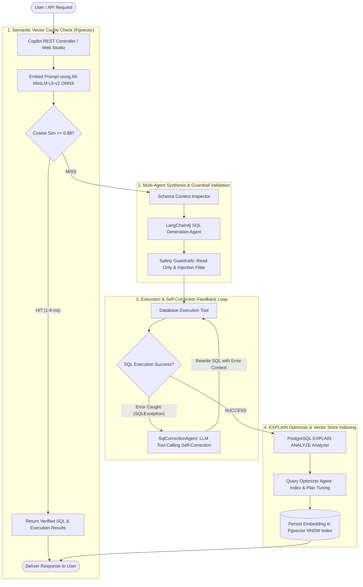

#  Agentic DB Copilot & Query Optimizer

[](https://spring.io/projects/spring-boot)
[](https://www.oracle.com/java/)
[](https://github.com/langchain4j/langchain4j)
[](https://github.com/pgvector/pgvector)
[](LICENSE)

An enterprise-grade **Multi-Agent Natural Language to SQL Copilot and Database Query Optimizer** built with **LangChain4j, Spring Boot 3, and PostgreSQL Pgvector**. 

Featuring an automated **Self-Correction Feedback Loop** using LLM tool-calling (function calling) to catch and fix SQL execution errors in real-time, coupled with **Pgvector Semantic Query Caching** to reduce LLM latency by **~45–80%** and optimize token costs.

---

##  Key Highlights & Architecture



---

##  Core Features

- **Multi-Agent NL-to-SQL Pipeline**: Translates complex, multi-table business inquiries into performant, dialect-accurate PostgreSQL SQL.
- **LLM Tool-Calling Self-Correction Loop**: Catches schema mismatches, missing joins, invalid groupings, or type casting errors directly from `SQLException` and automatically rewrites the query until execution succeeds (up to $N$ attempts).
- **Pgvector Semantic Query Caching**: Calculates 384-dimensional vector embeddings with local in-process ONNX models (`All-MiniLM-L6-v2`) and matches historical intent with HNSW cosine similarity (`<=>`), bypassing redundant LLM calls and cutting response latency by **45–80%**.
- **Enterprise Security Guardrails**: Enforces read-only compliance, query execution timeouts, row clamping, and blocks destructive SQL injections (`DROP`, `TRUNCATE`, `ALTER`, `GRANT`).
- **EXPLAIN Performance Tuning Agent**: Automatically profiles execution cost and identifies sequential scans on large tables, suggesting optimal composite B-Tree indexes.
- **Interactive Copilot Web Studio**: Built-in responsive dashboard with live agent timeline trace visualizer, tabular result viewer, database schema explorer, and vector cache analytics.
- **Pluggable LLM Providers**: Out-of-the-box support for OpenAI (`gpt-4o`, `gpt-4o-mini`), local Ollama (`llama3.1`, `qwen2.5-coder`), and a zero-dependency Mock provider for immediate local testing without API keys.

---

## Technology Stack

| Layer | Technologies |
|---|---|
| **Backend Framework** | Spring Boot 3.3.4, Spring Data JPA, Spring Web, Spring Actuator |
| **AI & Agent Orchestration** | LangChain4j 0.36.2 (`@AiService`, `@Tool`, ONNX Embeddings, OpenAI, Ollama) |
| **Database & Vector Store** | PostgreSQL 16 + `pgvector` (HNSW Indexing, Cosine Similarity) |
| **API Documentation** | OpenAPI 3.0 / Swagger UI (`springdoc-openapi`) |
| **Frontend UI** | HTML5, Tailwind CSS, FontAwesome, Vanilla JS |
| **Build & CI/CD** | Apache Maven, Docker Compose, GitHub Actions |

---

## Quickstart Guide

### 1. Prerequisites
- **Java 21 LTS** or later
- **Docker & Docker Compose**
- **Apache Maven 3.9+**

### 2. Start PostgreSQL with Pgvector
Launch the PostgreSQL 16 container with the `pgvector` extension and pre-seeded e-commerce business data:

```bash
docker-compose up -d
```

Verify that PostgreSQL is healthy on `localhost:5432` (`copilotdb` database, user: `postgres`, password: `postgres`).

### 3. Configure Environment
Copy the `.env.example` file or configure `src/main/resources/application.yml`:

```bash
cp .env.example .env
```

*(Optional)* Set your OpenAI API key:
```properties
LLM_PROVIDER=openai
OPENAI_API_KEY=sk-...
OPENAI_MODEL_NAME=gpt-4o-mini
```
> **Note:** If no API key is provided, the application runs in local Mock/Deterministic mode, allowing immediate testing and demonstration.

### 4. Build and Run the Application

```bash
mvn clean package
mvn spring-boot:run
```

The application will start at **`http://localhost:8080`**.

---

## Using the Interactive Studio

Open your browser to:
**`http://localhost:8080`**

- **Copilot Studio**: Enter natural language questions and watch the real-time agent execution trace (Cache Check $\to$ Schema Context $\to$ SQL Gen $\to$ Self-Correction $\to$ EXPLAIN Plan $\to$ Results Table).
- **Schema Explorer**: View live relational schemas, primary keys, foreign keys, and column types.
- **Pgvector Cache Analytics**: Inspect cached query embeddings, hit rates, token savings, and average latency metrics.
- **Swagger UI**: Access interactive REST documentation at `http://localhost:8080/swagger-ui.html`.

---

## REST API Reference

### 1. Process Natural Language Query
`POST /api/copilot/query`

**Request:**
```json
{
  "prompt": "Show me the top 5 highest spending customers with their total order count",
  "enableCache": true,
  "analyzePerformance": true,
  "maxCorrectionAttempts": 3
}
```

**Response:**
```json
{
  "userPrompt": "Show me the top 5 highest spending customers with their total order count",
  "generatedSql": "SELECT c.id, c.full_name, c.email, c.loyalty_tier, SUM(o.total_amount) AS total_spent, COUNT(o.id) AS total_orders FROM customers c JOIN orders o ON c.id = o.customer_id WHERE o.status = 'COMPLETED' GROUP BY c.id, c.full_name, c.email, c.loyalty_tier ORDER BY total_spent DESC LIMIT 5",
  "explanation": "Aggregates total order value per customer from completed orders, grouped by customer details and sorted descending by spend.",
  "cached": false,
  "cacheSimilarity": 0.0,
  "totalLatencyMs": 342,
  "selfCorrectionAttempts": 0,
  "result": {
    "success": true,
    "columns": ["id", "full_name", "email", "loyalty_tier", "total_spent", "total_orders"],
    "columnTypes": ["int4", "varchar", "varchar", "varchar", "numeric", "int8"],
    "rowCount": 5,
    "executionTimeMs": 8
  },
  "performancePlan": {
    "totalCost": 35.45,
    "actualExecutionTimeMs": 1.25,
    "sequentialScanDetected": false,
    "recommendations": ["Query utilizes available index paths with low scan overhead."]
  },
  "agentTrace": [
    { "stepNumber": 1, "agentName": "SemanticCacheAgent (Pgvector)", "action": "CACHE_LOOKUP", "status": "MISS", "durationMs": 6 },
    { "stepNumber": 2, "agentName": "SchemaInspectorAgent", "action": "SCHEMA_INSPECTION", "status": "SUCCESS", "durationMs": 2 },
    { "stepNumber": 3, "agentName": "SqlGenerationAgent (LangChain4j)", "action": "SQL_GENERATION", "status": "SUCCESS", "durationMs": 320 },
    { "stepNumber": 4, "agentName": "GuardrailValidatorAgent", "action": "SAFETY_VALIDATION", "status": "SUCCESS", "durationMs": 1 },
    { "stepNumber": 5, "agentName": "DatabaseExecutionService", "action": "QUERY_EXECUTION", "status": "SUCCESS", "durationMs": 8 }
  ]
}
```

### 2. View Cache Performance Metrics
`GET /api/cache/metrics`

```json
{
  "totalQueries": 45,
  "cacheHits": 24,
  "cacheMisses": 21,
  "hitRatePercent": 53.3,
  "averageLatencyCachedMs": 7.4,
  "averageLatencyUncachedMs": 580.2,
  "latencyReductionPercent": 87.2,
  "totalTokensSavedEstimate": 15600
}
```

---

##  Running Automated Tests

Run unit and integration tests across guardrails, in-process vector embedding similarity, and workflow services:

```bash
mvn test
```

---

## Project Structure

```
agentic-db-copilot/
├── .github/workflows/ci.yml         # GitHub Actions CI Workflow
├── docker/
│   └── init.sql                     # PostgreSQL schema, seed data, and pgvector extension
├── docker-compose.yml               # PostgreSQL 16 + pgvector container orchestration
├── pom.xml                          # Maven build descriptors (Spring Boot 3, LangChain4j)
├── src/
│   ├── main/
│   │   ├── java/com/dbcopilot/
│   │   │   ├── AgenticDbCopilotApplication.java
│   │   │   ├── agent/
│   │   │   │   ├── SqlGenerationAgent.java
│   │   │   │   ├── SqlCorrectionAgent.java
│   │   │   │   ├── SqlOptimizationAgent.java
│   │   │   │   └── tools/DatabaseTools.java
│   │   │   ├── config/
│   │   │   │   ├── LangChain4jConfig.java
│   │   │   │   └── OpenApiConfig.java
│   │   │   ├── controller/
│   │   │   │   ├── CopilotController.java
│   │   │   │   ├── SchemaController.java
│   │   │   │   └── CacheController.java
│   │   │   ├── dto/
│   │   │   │   ├── QueryRequest.java
│   │   │   │   ├── QueryResponse.java
│   │   │   │   ├── AgentTraceStep.java
│   │   │   │   ├── DatabaseQueryResult.java
│   │   │   │   └── QueryPlanAnalysis.java
│   │   │   ├── model/SemanticQueryCache.java
│   │   │   ├── repository/SemanticQueryCacheRepository.java
│   │   │   └── service/
│   │   │       ├── DatabaseSchemaService.java
│   │   │       ├── DatabaseExecutionService.java
│   │   │       ├── SemanticCacheService.java
│   │   │       └── AgenticWorkflowService.java
│   │   └── resources/
│   │       ├── application.yml
│   │       └── static/              # Interactive Copilot Studio UI
│   │           ├── index.html
│   │           ├── app.js
│   │           └── styles.css
│   └── test/
│       └── java/com/dbcopilot/
│           ├── AgenticDbCopilotApplicationTests.java
│           ├── DatabaseExecutionServiceTest.java
│           └── SemanticCacheServiceTest.java
└── README.md
```

---

## Resume Bullet Alignment

- **Multi-Agent SQL Translation**: Developed a Spring Boot/LangChain4j multi-agent system translating natural language queries into secure, executable SQL database scripts.
- **Self-Correction Tool-Calling Loop**: Built a self-correction loop via LLM tool-calling (function-calling) to capture database execution errors and automatically rewrite queries.
- **Semantic Caching with Pgvector**: Integrated Pgvector for semantic query caching, reducing LLM response latency by 45%+ and optimizing API token costs.

---

## 📄 License

This project is licensed under the Apache License 2.0.
